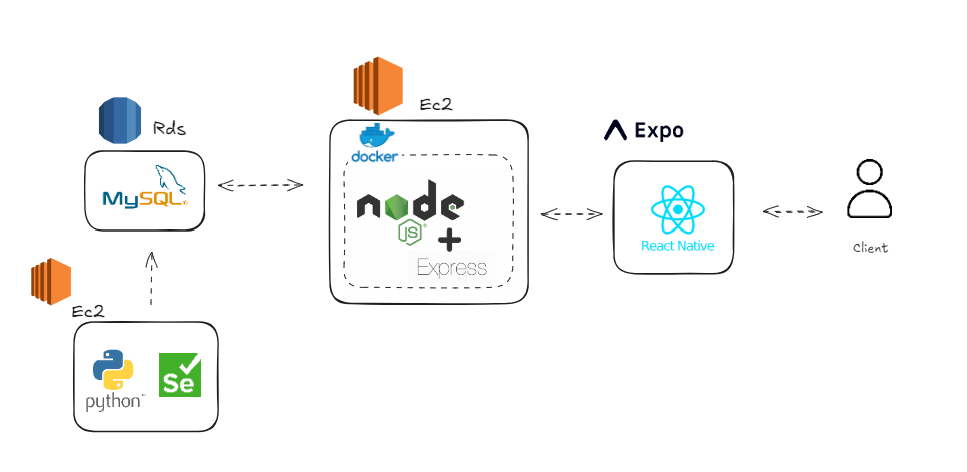
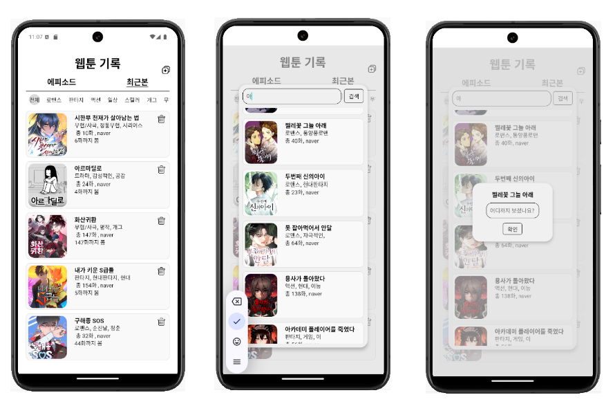

# 1. 프로젝트 배경 및 목표
- ### 프로젝트 배경 : 
    - 평소 여러 플랫폼에서 웹툰을 즐겨보는데 몇 화까지 봤는지에 대한 기록을 플랫폼마다 일일이 확인하기 어려워서 그냥 내가 하나 만들어서 쓰자!! 입니다~

- ### 목표 :
    - 스토어에 올려서 같은 불편함을 겪는 이들의 단비
    
    - 현재 APK로 빌드하여 먼저 혼자 써보며 만족스러워지면 스토어 등록 예정 (2024.10.30 ~ )

- ### 일정 및 개발 기간:
    - 개발 기간 : 2024.10.23 ~ 진행중 / 1인 

    - 기능 구현 완료 후 안드로이드 APK 빌드 후 1차 배포 (2024.10.30)  

  
# 2. 기술 스택

# 3. 시스템 아키텍처

# 4. 주요기능

# 5. 트러블 슈팅
- 앞으로 계속 개발 예정으로 노션으로 정리

- https://chipped-firewall-2ac.notion.site/12d9bfa6d01180f89b19de3e3a55c77e
